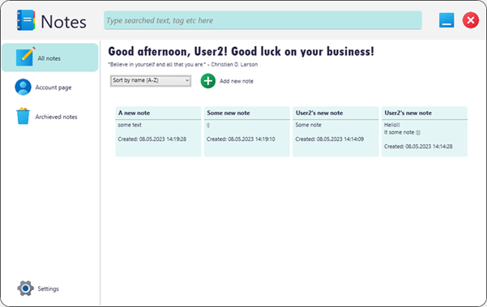
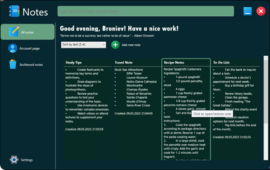
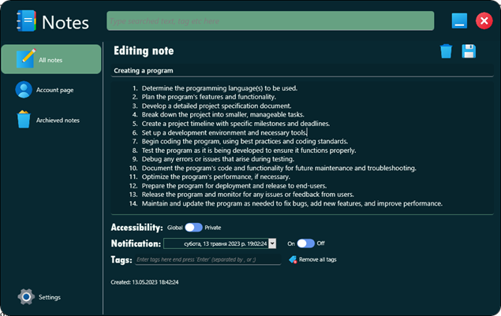
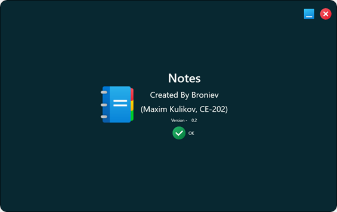
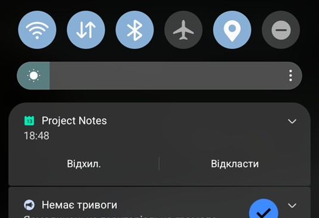

# 📝 Notes – Course Project (Legacy)

> **Status:** [ARCHIVED] This project is complete and will not receive further updates.  
> **Institution:** Khmelnytskyi Polytechnic Applied College (2023)  
> **Student:** Maksym Kulikov (Group KI-202)  
| **Stack:** C# / .NET (WPF) | **Supervisor:** S.V. Shchutskyi |

---

## 🚀 Project Overview

**Notes** is a legacy desktop application developed as a final project for the Object-Oriented Programming course. It features a modern UI/UX design implemented via WPF, focused on local note organization and management.

### ✨ Key Features
- **Modern UI:** Minimalist design with custom XAML styling.
- **Theme Support:** Native Light and Dark modes.
- **Local Storage:** Efficient handling of records on the local machine.
- **Beta Features:** Experimental mobile notification logic (non-functional in this version).

### 🛠 Technical Specs
- **Platform:** Windows 10+ (Desktop)
- **Framework:** .NET / WPF
- **Language:** C#

---

## 🖼 Interface Gallery

  
  

| Editing View | Documentation | Final Build |
|:---:|:---:|:---:|
|  |  |  |

---

## ⚠️ Notes for Developers
* **Operating System:** This application is strictly optimized for Windows 10/11. Legacy support was not a goal for this version.
* **Data:** All notes are stored locally; no cloud sync is implemented.
* **Maintenance:** No future updates or bug fixes are planned for this repository.

---

## ⚖️ Academic Integrity
Shared for educational and portfolio demonstration purposes only. Redistribution or submission of this project as your own academic work is strictly prohibited.
